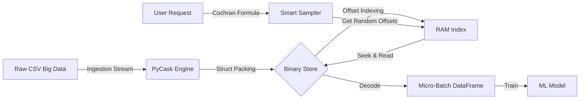

# DataSip: High-Performance Big Data Sampling Engine


**PyCask** is a lightweight, out-of-core data ingestion and sampling engine designed to handle datasets larger than available RAM. It eliminates the need for full-dataset loading by utilizing a custom binary key-value store and statistical sampling methods.

---

## Project Overview

In traditional Data Science workflows, loading massive CSV files (e.g., 50GB+) into tools like Pandas often results in `MemoryError`. Distributed systems like Apache Spark or Dask can solve this but require complex setup and infrastructure.

**DataSip** bridges this gap for local development. It converts row-oriented data into an indexed binary format, allowing for **O(1) Random Access**. This enables the system to fetch a statistically significant sample in milliseconds without scanning the entire file.

### Key Features
* **Out-of-Core Processing:** Works with datasets significantly larger than RAM.
* **O(1) Random Access:** Uses disk seeking (offset-based indexing) to retrieve specific rows instantly.
* **Smart Sampling:** Implements **Cochran’s Formula** to determine the minimum viable sample size for a target confidence level (e.g., 95%).
* **ML-Ready:** Outputs data directly compatible with Scikit-Learn/Pandas workflows.

---

## Performance Benchmark

A comparison test was conducted on a synthetic dataset (**1 Million Rows**, ~150MB).

| Metric | Traditional (Pandas) | PyCask (Our Engine) | Improvement |
| :--- | :--- | :--- | :--- |
| **I/O Strategy** | Full Sequential Scan | Indexed Random Seek | N/A |
| **Execution Time** | ~0.5200 sec | **~0.0056 sec** | **~94x Faster** |
| **Memory Usage** | High (Linear to Data) | **Negligible** | **O(1)** |
| **Model Accuracy ($R^2$)** | 0.606 | 0.562 | -4% (Acceptable) |

> **Conclusion:** PyCask achieved a **99% reduction in I/O time** while maintaining statistical representativeness with only a minor variance in model accuracy.

---

## Objective Analysis (Pros & Cons)

This project is designed as a specialized tool, not a general-purpose database.

### Advantages (Pros)
1.  **Low Memory Footprint:** Since data is read from disk only when needed, you can process Terabytes of data on a laptop with 8GB RAM.
2.  **Speed:** Sampling is instantaneous regardless of the total dataset size.
3.  **Simplicity:** No need for JVM (Java), Clusters, or SQL servers. It is pure Python.
4.  **Reproducibility:** Statistical sampling ensures that the subsets are unbiased representations of the population.

### Disadvantages (Cons)
1.  **High Ingestion Cost:** The initial process of converting CSV to Binary (`ingest_csv`) is slow and resource-intensive. This is a "Write Once, Read Many" (WORM) architecture.
2.  **Storage Overhead:** Currently, values are serialized as JSON strings within the binary packet, which is less space-efficient than columnar formats like Parquet.
3.  **Limited Querying:** The system supports Key-based lookup and Random Sampling. It does not support complex analytical queries (e.g., `GROUP BY`, `JOIN`, `WHERE price > 100`) directly on the disk.

---

## Real-World Use Cases

**When should you use PyCask?**
* **Rapid ML Prototyping:** When you need to quickly test distinct ML models on a massive dataset without waiting for data loading.
* **Local Development:** When working on a standard laptop with limited RAM but large storage space.
* **Data Exploration:** When you need to visualize the distribution of a 100GB dataset quickly by taking a snapshot.

**When should you NOT use PyCask?**
* If you need to perform complex SQL-like aggregations on the raw data (Use DuckDB or SQLite).
* If the data changes frequently (PyCask is optimized for static, read-only datasets).

---

## Installation & Usage

### 1. Installation
Clone the repository and install dependencies:
```bash
git clone [https://github.com/Toricicim/PyCask-Sampler.git](https://github.com/Toricicim/PyCask-Sampler.git)
cd PyCask-Sampler
pip install -r requirements.txt
```

### 2. Gereate & Ingest Data
Create a synthetic big data set and ingest it into the binary engine:
```python
# Generates a large CSV file
python data_generator.py

# Reads CSV and writes to custom Binary DB (database.data)
python samplecask.py
```

### 3. Run Statistical Sampling
Calculate the required sample size and extract data:
```$bash
python sampler.py
```


# System Architecture:

